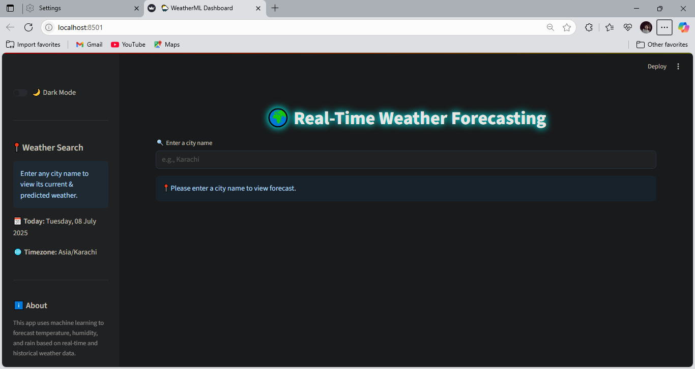
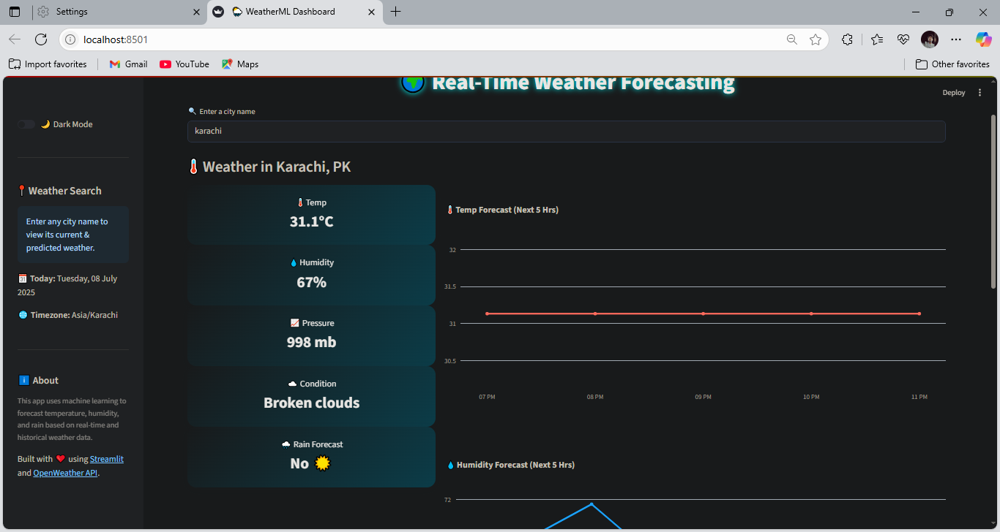
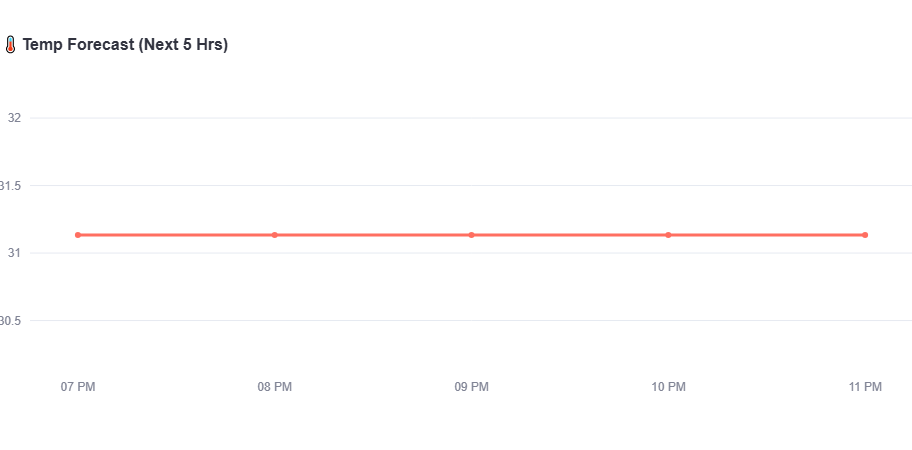
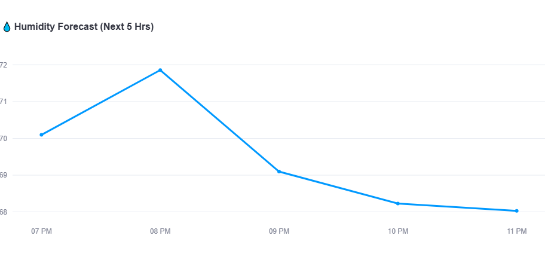

# 🌦️ Real-Time Weather Forecasting App

This project uses **Machine Learning and real-time weather APIs** to dynamically predict temperature, humidity, and rainfall for any city in the world. Built with a modern **Streamlit dashboard**, it brings intelligent forecasting to users in an interactive and visual way.

---

## 📌 Table of Contents  
- [📖 Introduction](#📖-introduction)  
- [🔍 Data Collection](#🔍-data-collection)  
- [🧹 Preprocessing & Feature Engineering](#🧹-preprocessing--feature-engineering)  
- [📊 ML-Based Weather Prediction](#📊-ml-based-weather-prediction)  
- [📉 Visualization & Interactivity](#📉-visualization--interactivity)  
- [📈 Insights Generated](#📈-insights-generated)  
- [🛠️ Technologies Used](#🛠️-technologies-used)  
- [🗂️ Folder Structure](#🗂️-folder-structure)  
- [🚀 How to Run Locally](#🚀-how-to-run-locally)  
- [☁️ Streamlit Cloud Deployment](#☁️-streamlit-cloud-deployment)  

---

## 📖 Introduction  
With unpredictable climate changes, having a localized, intelligent weather forecasting tool is crucial. This app combines **real-time weather data** and **historical trends** to forecast:

- 🌡️ Temperature (next 5 hours)  
- 💧 Humidity (next 5 hours)  
- 🌧️ Rain (Yes/No)

---

## 🔍 Data Collection  

- **Real-time data** from **OpenWeather API**  
- **Historical data** (past 7 days) from **Visual Crossing API**  
- Fields Collected:
  - `Temperature`, `Humidity`, `Pressure`
  - `Wind Speed`, `Weather Condition`
  - Geolocation (Latitude/Longitude)

---

## 🧹 Preprocessing & Feature Engineering  

- Conversion of text conditions (e.g., "Light Rain") to numerical labels  
- Feature creation from:
  - Temperature highs/lows
  - Wind speed
  - Atmospheric pressure
- Timezone-aware datetime processing via `pytz`

---

## 📊 ML-Based Weather Prediction  

### ML Models Used:

| Task         | Model Type             | Framework       |
|--------------|------------------------|------------------|
| 🌧️ Rain      | Random Forest Classifier | Scikit-learn     |
| 🌡️ Temp      | Random Forest Regressor  | Scikit-learn     |
| 💧 Humidity  | Random Forest Regressor  | Scikit-learn     |

### 💡 Key Features

- Each model is **trained live** on dynamically fetched 7-day data  
- Forecast is tailored per city entered by the user  
- Classifies Rain as ☀️ "No" or ☔ "Yes" based on conditions

---

## 📉 Visualization & Interactivity  

**Visual Tools:**

- 📊 **Plotly** for interactive forecast graphs  
- 📍 **PyDeck** for map rendering based on city geolocation  
- 📈 Line plots for predicted temp/humidity trends  
- 🎛️ Sidebar toggle for **Dark Mode** 🌙 and user instructions  

---

## 📈 Insights Generated  

- Predictive performance varies by data availability for each city  
- Real-time weather aligns closely with forecast in short term  
- Can be extended to generate alerts (e.g., rain warning, extreme temps)

---

## 🛠️ Technologies Used  

- 🐍 **Python 3.9+**  
- 📦 `streamlit` – UI framework  
- 📡 `requests` – API calls  
- 🧠 `scikit-learn` – Machine learning  
- 📊 `plotly`, `pydeck` – Visualization  
- 🌍 `geopy`, `pytz` – Location and timezone support  

## 🗂️ Folder Structure

```bash
weather-app/
├── app.py # Streamlit UI script
├── w_model.ipynb # ML + data fetching logic
├── requirements.txt # Python dependencies
├── pngs/ # Dashboard screenshots (for README)
│ ├── dashboard.png
│ ├── weather.png
│ ├── tempforecast.png
│ ├── humidforecast.png
└── README.md # Project documentation
```
---

## 📸 Dashboard Previews

### 🌍 Main Dashboard 


### 📈 Forecasting Charts


### 🌡️ Temperature Forecast


### 💧 Humidity Forecast


---

## 🚀 How to Run Locally

1. **Clone the repo**

   ```bash
   git clone https://github.com/haidersjaf77/Weather-App.git
   cd Weather-App
   ```

2. **Install dependencies**

   ```bash
   pip install -r requirements.txt
   ```

3. **Add your API keys in `w_model.ipynb`**
Open the `w_model.ipynb` file and replace the placeholders with your actual keys:

   ```python
   VC_API_KEY = 'YOUR_VISUAL_CROSSING_KEY'
   api_key = 'YOUR_OPENWEATHER_KEY'
   ```

4. **Run the app**

   ```bash
   streamlit run app.py
   ```